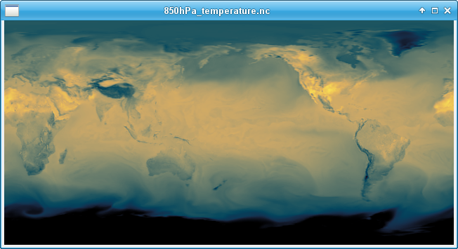

# ncmaps
**ncmaps brings scientific colormaps to ncview.**

[ncview](http://meteora.ucsd.edu/~pierce/ncview_home_page.html) is a legacy, light-weight netcdf viewer that is still in wide use in the geosciences community.

One of the weak points of ncview is its colormaps (e.g. jet), in particular the lack of *scientific* (*aka perceptually uniform*) colormaps.

**ncmap** adds scientific colormaps to the configuration path of ncview, so that your data can be displayed using *viridis*, *inferno*, *cmocean*, and more.

## Examples

Viridis (Matplotlib)

Thermal (cmocean)

Oslo (cmcrameri)

Eclipse (cmasher)

## Installation

There are two ways for getting ncview to use the scientific colormaps:

*Option 1:* 
 1. Fetch the ncmaps repo from github;
 2. Define (export) a shell environment variable to the sub-directory `ncmaps/`: `export NCVIEWBASE=</path/to/local/ncmaps/copy>/ncmaps/`.

For example: `export NCVIEWBASE=/home/tomlav/software/ncmaps/ncmaps/` (note `ncmaps` twice). You should add the export to your `.profile`.

*Option 2:*
 1. Fetch the ncmaps repo from github;
 2. Run `python3 write_ncmaps` in the terminal;
 3. Define (export) a shell environment variable: `export NCVIEWBASE=${HOME}/.ncmaps`;

The second option is mainly if you want to develop the package and add more colormaps (please consider making a PR).
 
In both cases, new colormaps should be available next time you run `ncview`.

## Supported colormaps
*ncmaps* harvests scientific colormaps from the following python modules:
 * [matplotlib](https://matplotlib.org/stable/tutorials/colors/colormaps.html)
 * [cmocean](https://matplotlib.org/cmocean/)
 * [cmcrameri](https://pypi.org/project/cmcrameri/)

These modules must be installed and accessible to your your python implementation (e.g. via *pip* or *conda*) **before** running `write_ncmaps`.
This might require activating a *virtualenv*. Colormap modules that are not available are skipped.

## Command-line parameters

Running `write_ncmaps` should be enough in most cases, but check `write_ncmaps -h`.

## Author
Thomas Lavergne, Norwegian Meteorological Institute

(ncmaps expands https://github.com/samhatfield/ncview-scientific-colour-maps)
