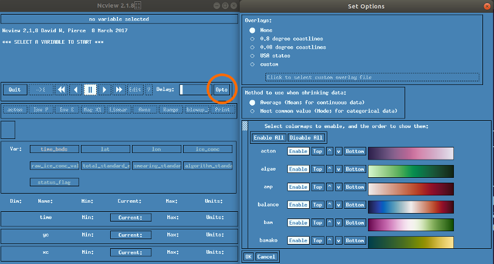

# ncmaps
**ncmaps brings scientific colormaps to ncview.**

[ncview](http://meteora.ucsd.edu/~pierce/ncview_home_page.html) is a legacy, light-weight netcdf viewer that is still in wide use in the geosciences community.

One of the weak points of ncview is its colormaps (e.g. jet), in particular the lack of *scientific* (*aka perceptually uniform*) colormaps.

**ncmap** adds scientific colormaps to the configuration path of ncview, so that your data can be displayed using *viridis*, *inferno*, *cmocean*, and more.

## Examples

Viridis (Matplotlib)

Thermal (cmocean)

Oslo (cmcrameri)

## Installation

There are two ways for getting `ncview` to use the scientific colormaps:

*Option 1: (recommended, easiest)* 
 1. Fetch this repo from github;
 2. Define (export) a shell environment variable to the sub-directory `ncmaps/`: `export NCVIEWBASE=</path/to/local/ncmaps/copy>/ncmaps/`.
 3. Copy `ncmaps/.ncviewrc` to your HOME: `cp </path/to/local/ncmaps/copy>/ncmaps/.ncviewrc ${HOME}`.

For example: `export NCVIEWBASE=/home/tomlav/software/ncmaps/ncmaps/` (note `ncmaps` twice) and `cp /home/tomlav/software/ncmaps/ncmaps/.ncviewrc /home/tomlav/`.
You should add the export to your `.profile`.

*Option 2: (for developers)*
 1. Fetch this repo from github;
 2. Run `python3 write_ncmaps` in the terminal;
 3. Define (export) a shell environment variable: `export NCVIEWBASE=${HOME}/.ncmaps`;
 4. Copy `${HOME}/.ncmaps/.ncviewrc` to your HOME: `cp ${HOME}/.ncmaps/.ncviewrc ${HOME}/`.

Here again, you should put the `export` command in your `.profile`.

In both cases, new colormaps should be available next time you run `ncview`.

## Supported colormaps
*ncmaps* harvests scientific colormaps from the following python modules:
 * [matplotlib](https://matplotlib.org/stable/tutorials/colors/colormaps.html)
 * [cmocean](https://matplotlib.org/cmocean/)
 * [cmcrameri](https://pypi.org/project/cmcrameri/)

If you choose _Option 2_ above, these modules must be installed and accessible to your your python implementation
(e.g. via *pip* or *conda*) **before** running `write_ncmaps`. This might require activating a *virtualenv*.

Installing the colormaps modules is not required if you choose Option 1 above.

## Notes about ncview
1. The most widely available version of `ncview` _(Ncview 2.1.8 David W. Pierce  8 March 2017)_ has a bug in the way
it loads the colormaps. This bug limits the number of colormaps we can prepare to a maximum of 79.
When triggered, the bug results in ncview refusing to launch with `Error, too many colormaps -- max is 200`.
Should this happen to you, try to: delete your `.ncviewrc` file (in your HOME). If it persists, fetch a new version of this repo.
This bug is the reason why we do not support additional colormaps (e.g. `cmasher`).

2. `ncview` offers a way to enable, disable, and re-order the colormaps (see button `Opts`). The configuration is saved into the
`.ncviewrc` file in your HOME. The `.ncviewrc` file we provide in this package 1) disables all the "legacy" colormaps of `ncview` and
2) orders the colormaps by name (alphabetic). Using our `.ncvirewc` file will overwrite your own preferences. You can start from our
`.ncvirewc` file and further customize your colormaps.

## Author
Thomas Lavergne, Norwegian Meteorological Institute

(ncmaps expands https://github.com/samhatfield/ncview-scientific-colour-maps)
